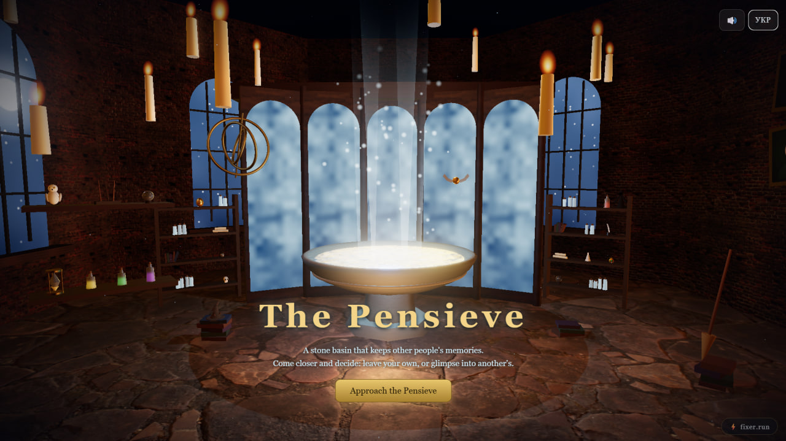

# Pensieve



A 3D web app inspired by the Pensieve from Harry Potter. Visitors approach a
stone basin in a Hogwarts hall and either leave a memory of their own or dive
in to read a random memory left by someone else.

Built with Three.js (PBR textures, HDRI lighting, soft shadows, bloom) on the
front end and a small Flask API on the back end. All front-end dependencies and
assets are served locally.

## Features

- Three scenes: the hall with the basin, a vortex transition, and the memory
  realm where a card unfolds into the story.
- Shared memory pool stored in SQLite locally or Postgres in production.
- Ukrainian and English UI. Visitors outside Ukraine get English by default;
  a manual choice is remembered.
- Optional machine translation of memories into English, cached per memory.
- Password-protected admin panel for reviewing and deleting memories.
- Per-IP rate limit on submissions.
- Synthesized WebAudio ambience and sound effects; optional streamed music
  tracks per scene (see `TRACKS` in `public/js/core/audio.js`).
- Touch and small-screen support with a reduced pixel-ratio cap on phones.

## Requirements

- Python 3.10+
- A browser with WebGL 2 and ES module support

## Run locally

Linux / macOS:

```bash
./start.sh
```

Windows:

```bash
start.bat
```

Both scripts create `venv/`, install dependencies, seed an empty database and
start the server at http://localhost:8000.

Manual setup:

```bash
python3 -m venv venv
./venv/bin/pip install -r requirements.txt
./venv/bin/python seed.py    # 25 starter memories, only if the database is empty
./venv/bin/python app.py
```

`seed.py --merge` adds the starter memories that are missing from a non-empty
database.

## Project layout

```
app.py                  entry point (Flask, port 8000)
api/index.py            Vercel serverless entry point (same app as WSGI)
admin.html              admin panel, served only at /adminer
seed.py                 starter memories
server/
  __init__.py           app factory, secrets, /adminer route
  db.py                 storage: SQLite by default, Postgres when DATABASE_URL is set
  routes.py             JSON API, rate limit, admin endpoints
  translate.py          machine translation helper
public/
  index.html            markup and UI overlays
  css/                  base styles and responsive overrides
  js/
    main.js             app state, camera choreography, scene switching
    api.js              API client
    ui.js               DOM overlays, loader, quill cursor
    i18n.js             uk/en dictionary and DOM bindings
    core/               tweens, post-processing, shared FX, WebAudio
    scenes/hall/        room, basin, props, snitch, wand deposit animation
    scenes/realm/       memory realm and story cards
    scenes/vortex/      tunnel between scenes
  assets/               textures, HDRI
  vendor/               Three.js r160, post-processing passes, RGBELoader
docs/                   screenshot for this README
data/                   local database and secrets (git-ignored)
```

## API

| Method | Path                               | Description                                  |
|--------|------------------------------------|----------------------------------------------|
| POST   | `/api/memories`                    | `{author?, title, body}`; returns `{id, total}` |
| GET    | `/api/memories/random?exclude=<id>&lang=<uk\|en>` | random memory, optionally excluding one |
| GET    | `/api/memories/count`              | `{total}`                                    |
| GET    | `/api/geo`                         | visitor country code from Vercel headers     |
| POST   | `/api/admin/login`                 | `{password}`; starts an admin session        |
| POST   | `/api/admin/logout`                | ends the admin session                       |
| GET    | `/api/admin/memories`              | all memories (admin)                         |
| DELETE | `/api/admin/memories/<id>`         | delete a memory (admin)                      |

Limits: author 60, title 120, body 5000 characters; 5 submissions per IP per
10 minutes. Errors are JSON with a `code` field that the client localizes.

## Admin panel

`/adminer` lists all memories with a delete button. Locally the password is
generated on first run and stored in `data/admin_password.txt`; replace it
with your own and restart. Sessions are signed with `data/secret_key.txt`.

## Translation

When the UI language is English, `/api/memories/random?lang=en` returns the
memory translated into English. Translation uses Google Translate's public
web endpoint without an API key; it is unofficial and may stop working at any
time. Each memory is translated once and cached in the `translations` table.
If translation fails or exceeds its time budget, the original text is served.

## Deploy to Vercel

The filesystem on Vercel is read-only, so the database and secrets live
outside the repo.

1. Import the repository into Vercel with the framework preset set to
   **Other**. Static files are served from `public/`; `/api/*` and `/adminer`
   are rewritten to the Flask function in `api/index.py` (see `vercel.json`).
2. Add a Postgres database from **Storage** (for example Neon). Vercel sets
   `DATABASE_URL` automatically.
3. Add environment variables:
   - `ADMIN_PASSWORD`: admin panel password
   - `SECRET_KEY`: long random string used to sign sessions
4. Seed the production database from your machine:

   ```bash
   DATABASE_URL=<connection string> ./venv/bin/python seed.py
   ```

`server/db.py` picks the backend at startup: Postgres when `DATABASE_URL` is
set, SQLite otherwise.

## Credits

Textures and HDRI from Poly Haven and ambientCG (CC0). Three.js r160 (MIT).
